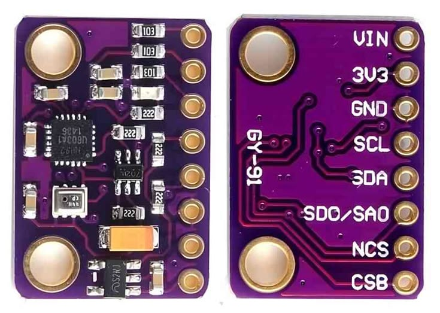
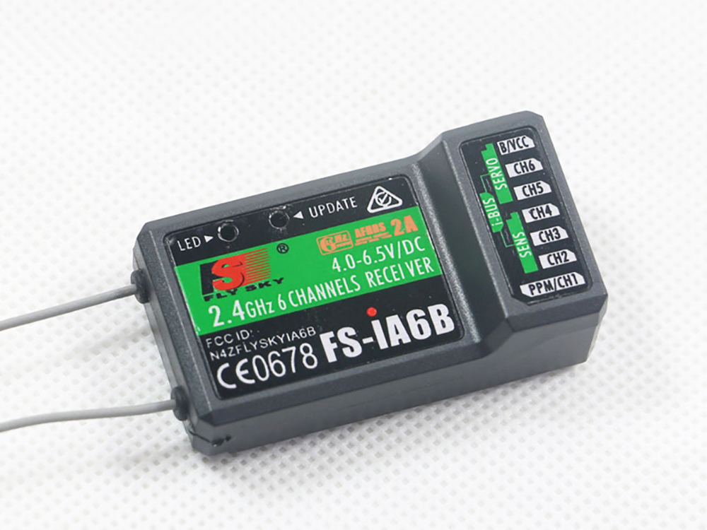
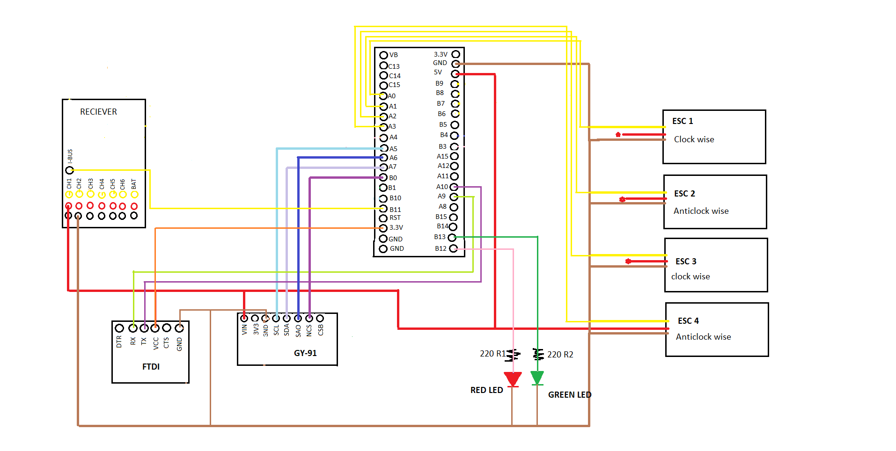
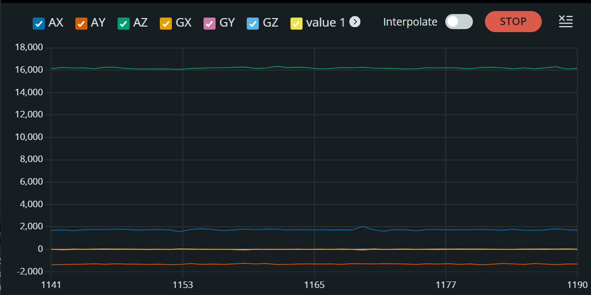
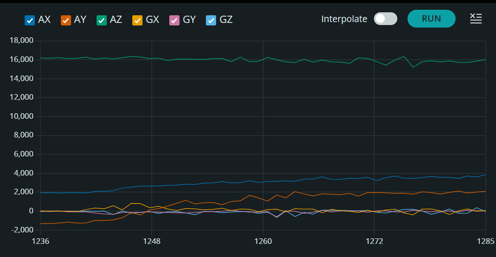
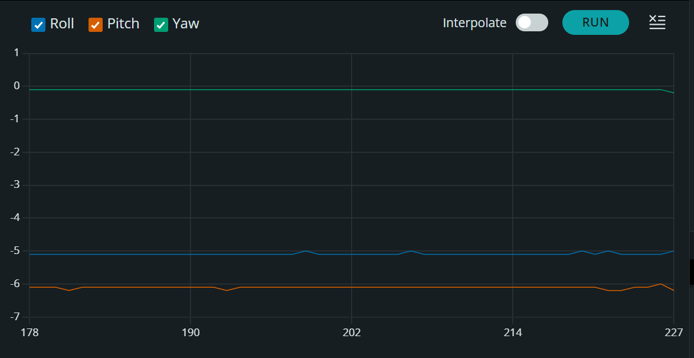
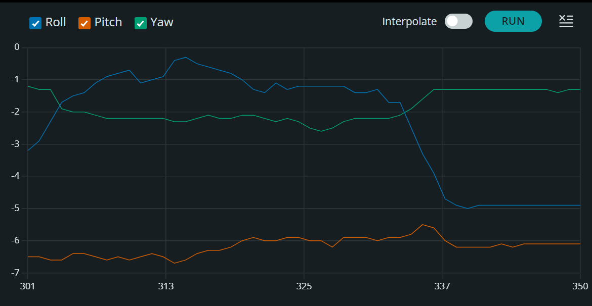
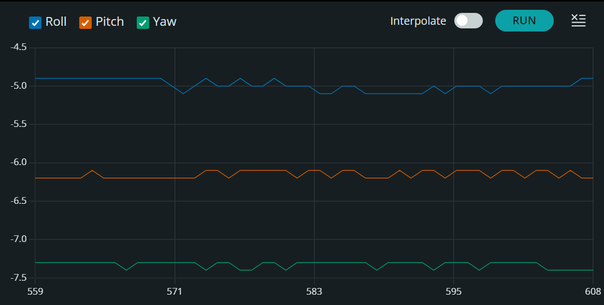

# AZRAEL.V1.0.  Flight Controller

**AZRAEL.V1.0** is an embedded flight control system engineered from scratch for the **STM32F103C8T6 (Blue Pill)** microcontroller. The project focuses on efficient hardware utilization through modular firmware design, dedicated peripheral isolation, high-speed SPI sensor acquisition, direct timer register control for ESC actuation, and a custom calibration engine that ensures consistent and reliable pre-flight operation.

---

## 1. Bill of Materials (BOM)

The hardware needed for the AZRAEL.V1.0 is listed below. I made this hardware list for your convenience. This list is a suggestion and it's your own responsibility to ensure that the products meet your specific requirements.

  - stm32f1 (Blue pill) 
  - gy-91 (10 dof)
  - 2 x 220 ohm resistor
  - 1 Green led 
  - 1 Red led  
  - Flysky-i6 with fs-iA6B receiver (must have i-bus)
  - FTDI module
  - Perf board

### 1.1 The Gy-91 (IMU)



*Figure: GY-91*

The only IMU that is supported by the AZRAEL.V1.0 software is the Gy-91 (10 dof). This is because the AZRAEL.V1.0 is expandible without changing the PCB, we will have magnetometer and bmp280 within the same IMU. But in this version of AZRAEL.V1.0 we will be using only 6 dof to keep it as simple as possible.

### 1.2 The transmitter and receiver


*Figure: Fs-iA6B*

Not every transmitter can be used for the AZRAEL.V1.0. This is because we will be needing receiver capable of giving i-bus signal outfit and flysky fs-i6 transmitter with fs-iA6B receiver is the best choice and the firmware is written accordingly.

The AZRAEL V1.0 needs standardized receiver pulses as described in the table below.

### 1.3 i-BUS Serial Receiver Channel Mapping

| Channel Array | Stick Function | Shared STM32 Input Pin | 1000 μs(Min Position) | 1500 μs(Neutral) | 2000 μs(Max Position) |
| :--- |:--- | :--- | :--- | :--- | :--- |
| `ibus_ch[0]` | Roll | PB11(via Serial3 Stream) | Roll Left | Center | Roll Right |
| `ibus_ch[1]` | Pitch | PB11 | Nose Down(Forward) | Center | Nose Up(Backward) |
| `ibus_ch[2]` | Throttle | PB11 | Idle | Mid-Throttle | Full |
| `ibus_ch[3]` | Yaw | PB11 | Yaw Left | Center | Yaw Right|

The receiver signal wire is connected to PB11 of the stm32 which is 5V DC signal tolerant and is on USART3 because to avoid the conflict between the receiver and serial debugger which is in USART1 we used a different USART for the peaceful execution of the receiver.

The receiver is powered by the +5V output of the BEC. The connection can be found on the schematic.

## 2. System Architecture Overview

The firmware utilizes a modular header design, splitting critical sub-systems into dedicated, isolated abstraction layers to guarantee maximum execution efficiency and clear logical boundaries.

```text
📁 cal_stm/
   ├── 📄 cal_stm.ino                 # Master Loop & High-Speed Scheduling
   ├── 📄 01_pins_and_includes.h      # Global Register Maps, Pinouts & Constants
   ├── 📄 02_imu_spi.h                # Low-Level SPI1 Driver (MPU-9250 / GY-91)
   ├── 📄 03_ibus_receiver.h          # USART3 i-BUS Serial Parser (FlySky Receiver)
   ├── 📄 04_esc_pwm.h                # Hardware Timer 2 (TIM2) PWM Core Generator
   ├── 📄 05_leds.h                   # Status & Diagnostic LED State Logic
   ├── 📄 06_calibration.h            # Interactive Calibration State Machine
   └── 📄 07_pid_flight_controller.h  # Madgwick AHRS Fusion & PID Control Loops
```

## 3. Hardware Evolution:From Prototype to Custom PCB

The development of AZRAEL.V1.O progressed through two distinct phases, shifting paradigms in both communication protocols and peripheral hardware configurations to optimize real-time performance.

### 3.1 Phase 1:The Breadboard Prototype (The I2C&PWM Baseline)


*Figure: Breadboard Prototype*

The initial proof-of-concept was constructed on a standard solderless breadboard to establish readings from the GY-91 IMU and process incoming transmitter control signals. 

- **Initial Protocol Choices**: The IMU was connected via the standard I2C communication bus, and a conventional receiver configuration was utilized where individual channels sent separate PWM pulse-width signals to discrete analog inputs on the microcontroller.

- **Prototyping Bottolenecks Encountered**:
   1. **High I2C Frame Error Rates**:Due to the long, unshielded jumper wires and parasitic rows on the breadboard, the I2C bus experienced extreme susceptibility to electromagnetic noise. This triggered frequent  bus timeouts and corrupted data registers, which is catastrophic for a stable flight loop.

   2. **Loop Timing Degradation**: Processing multiple distinct PWM channel inputs required reading multiple pins sequentially. This approach proved incredibly messy, hogged system overhead, and heavily slowed down the execution frequency of the core tracking scheduler.

### 3.2 Phase 2:The Production PCB(The SPI & i-BUS Breakthrough)
To eliminate bus noise and guarantee a deterministic 400Hz loop execution rate, the hardware architecture was completely re-engineered onto a custom production PCB.

- *(The Move to SPI): The I2C interface was completely abandoned in favor of High-Speed SPI1. By soldering the GY-91 directly to dedicated, short PCB traces and driving it via an explicit Chip-Select (PB0)pin, signal integrity was stabilized, allowing 14-byte raw data bursts to be pulled cleanly at an 18 MHz clock rate.

- *(The Move to i-BUS Serial): Individual channel PWM signal wires were replaced with the unified digital i-BUS serial protocol. Instead of splitting attention across separate pins, all 10 control channels are multiplexed down a single digital wire, allowing the flight engine to effortlessly parse input updates via software memory buffers.

## 4. Peripheral Isolation & Hardware Mapping

When migrating to the permanent PCB, a critical design choice was made to isolate data pipes and prevent serial traffic jams on the silicon chip.

### 4.1 Resolving USART Peripheral Linker Conflicts

The flight controller relies heavily on a real-time **Serial Debugger** running at 115200 baud to output telemetry to the PC. The debugger occupies **USART1**(`PA9` and `PA10`).

If the high-speed i-BUS receiver data stream had been dropped onto the same hardware serial lanes, a terminal communication conflict would occur-completely breaking the debugger or corrupting incoming control frames.

**The Solution**: The i-BUS input stream was completely isolated onto the hardware **USART3** peripheral, mapping the physical receiver signal pin strictly to `PB11`. Here, `PB11` was chosen cause it is also a 5V tolerant pin which can handle 5V DC output from the i-BUS.This Physical and logical separation allows the i-BUS receiver to process incoming pilot frames completely undisturbed while `USART1` continues streaming diagnostic data back to the desk interface seamlessly.

### 4.2 PCB Interfacing & Routing Map

| Component Name| Physical Sub-Module | STM32 Pin Target | Interface Type | Technical Selection Logic & Purpose|
| :--- | :--- | :--- | :--- | :--- |
|STM32F103C8T6(BLUE PILL) | Core Microcontroller | `System Core` | Core Processor | Runs an ARM Cortex-M3 32-bit architecture at 72MHz. Handles floating-point Madgwick sensor fusion equations within a tight 2500µs flight window.|
| GY-91 | 10-DOF Inertial Unit | `PA5`(SCK), `PA6`(MISO), `PA7`(MOSI), `PB0`(NCS)| SPI1 BUS | Houses the MPU-9250 IMU. Replaced the high-noise breadboard I2C topology with a rigid, direct SPI routing to capture raw 6-axis G-force and rotational rates flawlessly. |
| FlySky-iA6B | Serial RC Receiver | `PB11`(RX3) | USART3 Serial | Multiplexes all pilot stick movements down a signle data lane using high-speed i-BUS protocol at 115200 baud, completely isolated from diagnostic serial loops.|
|Electronic Speed Controllers(ESCs) |Qaud Motor Drivers |`PA0`(TIM2_CH1), `PA1`(TIM2_CH2), `PA2`(TIM2_CH3), `PA3`(TIM2_CH4) | Hardware PWM | Translates internal core commands into dynamic hardware motor drive currents. Driven directly via internal hardware Timer 2 reisters at 400Hz for razor-sharp motor response times.|
| Status Indicators | Red/Green Dual LEDs | `PB12` (RED),`PB13` (GREEN) | GPIO Output | Provides real-time visual diagnostic status indicators directly to the pilot (e.g active calibration states, arming configurations, and erros flashes).|

## 5. Complete Schematic Diagram


*Figure: Schematic*

The schematic below represents the complete electrical architecture of AZRAEL.V1.0

The STM32F103C8T6 (Blue Pill) acts as the central processing unit while all peripherals are isolated to dedicate communication buses to avoid data collisions.

### Key Connections

- GY-91 → SPI1
- Fs-iA6B → USART3 (PB11)
- ESCs → TIM2 PWM outputs
- LEDs → PB12 and PB13
- FTDI → USART1 for debugging and flashing

## 6. IMU Characterization & Valiation

Before integrating the flight controller onto the quadcopter frame, a series of validation tests were performed to verify sensor integrity, oreintation estimation stablilty and filter performance under vaious operating conditions.

The tests were conducted directly on the completed PCB assembly.

### 6.1 Raw IMU Validation (Flat Position)


*Figure: Raw IMU Validation (Flat)*

The PCB was placed on a stationary flat surface.

**Observations:**
- Accelerometer values remained stable.
- Gyroscope values stayed close to zero.
- No abnormal spikes were observed.

This test verified proper SPI communication and stable sensor acquisition.

### 6.2 Raw IMU Validation (Tilted Position)


*Figure: Raw IMU Validation*

The PCB was manually tilted.

**Observations:**
- Accelerometer axes changed according to orientation.
- Gyroscope measurements reacted to rotational motion.
- Sensor ouputs behaved consistently.

This validated orientation responsiveness before enabling closed-loop stablization.

### 6.3 Filter Validation (Flat Position)


*Figure: Filter Validation*

Filtered Euler angles were observed while the PCB remained stationary.

**Observations:**
- Noise amplitude was significantyly reduced.
- Orientation remained stable.
- Minor fluctuations were expected due to sensor noise.

### 6.4 Filter Validation (Tilted Position)


*Figure: Filter Validation(Tilted)*

The PCB was manually tilted and returned to different orientations.

**Observations:**
- Eulter angles smoothly followed movement.
- Sudden jumps were absent.
- Orientation estimates remained stable after movement ceased.

### 6.5 Artificial Vibration Test


*Figure: Artificial Vibration Test*

Artificial disturbance were introduced by repeatedly tapping the table beneath the PCB.

**Observations:**
- Oreintation estimated remained stable.
- The filter rejected most transient disturbances.
- No instability was observed.

Note:
This test is a preliminary vibration assessment and does not fully replicate high-frequency motor-induced vibrations encountered during actual flight.

## 7. Status Indication & User Interface

### 7.1 LED-Based Human-Machine Interface (HMI)

AZRAEL V1.0 incorporates a dedicated LED-based status indication system to provide real-time feedback regarding the operational state of the flight controller without requiring a serial debugging interface.

The indicator system is composed of two LEDs:

- **Red LED:** Indicates user attention, ongoing calibration procedures, or fault conditions.
- **Green LED:** Indicates successful initialization, healthy system operations, or an active fligth state.

### LED State Definitions

|Operating State|Red LED|Green LED|Description|
| :--- | :--- | :--- | :--- |
|Boot Sequence |OFF |OFF |System startup in progress|
|Boot Sequence Complete |ON |OFF |Initilization completed; awaiting next state|
|Gyroscope Calibration |ON |OFF |Gyroscope offset sampling in progress|
|Stick Calibration |ON |ON |Transmitter stick center and sweep calibration active|
|ESC Calibration |OFF |ON |Maximum and minimum throttle signals are being transmitted|
|Calibration Successful |OFF |ON |Calibration procedure completed successfully|
|Flight Mode (Disarmed) |ON |OFF |Flight mode entered but motors are not armed|
|Fligth Mode (Armed) |OFF |ON |Flight controller armed and ready for operation|
|RC Signal Lost/Motors Killed |ON |OFF |Receiver communication lost; motors disable as a safety measure|
|Fatal Error |Fast Blink |OFF |Critical system error detected|

## 8. PID Tuning & Dynamic Stabilization Guide
This section documents the explicit command interfaces, step-by-step sequential tuning methodology, and diagnostic error matrices used to stabilize the AZRAEL.V1.0 flight dynamics controller.

### 8.1 Serial Tuning Command Interface Reference
To adjust control loops on the fly without re-flashing the core silicon, use the interactive terminal tool running over `USART1` (115200 baud).
- **`p` (Lower Case):** Opens the interactive tuning menu. Prints all current axis gains, active operating ranges, and raw sensor level offsets.
- **`v` (Lower Case):** Saves all modified gains and level offsets directly to the non-volatile Flash memory. This configuration survives a full power cycle.

**Parameter Adjustment Syntax**
Commands must be issued as a single, contiguous string with no spaces: 
                  [Axis][Term][Value]

| Axis Identifier | Target Axis | COntrol Term | Term Meaning | Valid Range Bounds (MIN-Max) | Default Startup Value |
| :--- | :--- | :--- | :--- | :--- | :--- |
| `r` | Roll | `p` | Kp(Proportional) | 0.5->4.0 | `1.2` |
| `p` | Pitch | `i` | Ki(Integral) | 0.0->0.1 | `0.0` |
| `y` | Yae | `d` | Kd(Derivative) | 0.0->1.0 | `0.0` |

Examples:
- `rp1.5` -> Sets Roll Kp=1.5
- `pi0.02` -> Sets Pitch Ki=0.02

### 8.2 The Six-Phase Tuning Sequence (Follow Order Strictly!)

**PRE-FLIGHT WARNING:** Never attempt to tune Ki or Kd coefficients before establishing a stable, clean Kp baseline tracking response. All preliminary low-axis sweeps must be performed with props off or using a secure handheld rig.

Phase 1           Phase 2           Phase 3           Phase 4           Phase 5           Phase 6
[Zero Loops] ───> [Tune Roll KP] ───> [Tune Pitch KP] ───> [Tune KD Damp] ───> [Tune Yaw KP] ───> [Add KI Trim]

**Phase 1:Establish the Zero Baseline**

Zero out all derivative and integral terms across the system to prevent tracking loop windup from masking basic proportional behavior:
- Set `ri0.0`, `rd0.0`
- Set `pi0.0`, `pd0.0`
- Set `yi0.0`

**Phase 2:Tune Roll Proportional Authority (`K_p`)**
- **Initial Setup:** Inject a starting threshold of `rp1.2`.
- **Test Method:** Secure the frame safely,tilt the drone sharply along its roll axis, and observe the immediate motor response counter-thrust.
- **Evaluation:**
   - If response is sluggish/weak: Incrementally increase `rp` until the frame exhibits firm, authoritative resistance against manual displacement.
   - If the frame vibrates or buzzes high-frequency: You have pushed too far. Cut the current value exactly in half (`rp0.5` to `rp0.8`) and find the solid midpoint where it settles without oscillations.
   - Target: A firtm pushback that cleanly centers the frame without bouncing.

**Phase 3:Tune Pitch Proportional Authority (`k_p`)**
- Becausee quadcopter frames generally share identical mass distribution and geometric properties along their primary horizontal profiles, the Pitch axis parameters typically mirror Roll closely.
- Target: Initialize `pp1.2` and repeat the step-by-step scaling adjustments from Phase 2 until Pitch matches Roll stability.

**Phase 4:Tune Kd Derivative Damping**

With proportional boundaries safely defined, introduce the derivative term to counter rapind rotational changes and absorb sudden crisp stops.
- Initial Setup: Initialize both roll and pitch damping at a low baseline: `rd0.2` and `pd0.2`.
- Evaluation:
   - If the drone overshoots and oscillates slowly, slowly increase `rd` and `pd` values.
   - If the motors emit a hot, high-pitched mechanical vibration hum, the Kd term is amplification noise;back the values off immediately.
- Target: Single, clean snap back to level with zero tracking ring or visible oscillations.

**Phase 5:Tune Yaw Proportional Authority(`k_p`)**
- Initial Setup: Initialize `yp2.0` to account for the lower authority of counter-rotational torque stabilization.
- Target: Rotate the frame sharply by hand;increase `yp` until yaw tracking feels firmly locked in without spinning freely or feeling overly sensitive to input commands.

**Phase 6:Add Ki Integral Trim (Only if Needed)**
- Initial Setup: Introduce very minor steps starting at `ri0.01` and `pi0.01`.
- Evaluation: The integral loop acts as an error accumulator over time. Only employ this term if the quadcopter demonstrates a persistent, steady drift toward one side during a centered stick hover condition.
   - Caution: Excessively high Ki limits degrade performance by introducing slow,delayed, low-frequency tracking oscillations over time. If this develops, reduce the coefficients immediatly.

### 8.3 Dynamic Troubleshooting & Error Control Matric

Use this matrix during fligth analysis to identify control parameter bugs based on physical frame behavior: 

| Flight Symptom Observerd | Probable Root Cause | Target Correction Action |
| :--- | :--- | :--- |
| Drone drops a corner instantly, flips over, or lacks self-correction entirely.| $K_P$ is too low. | Increase `rp` and `pp` values incrementally. |
| High-frequency frame buzzing, motor over-heating, or fast oscillations. | $K_P$ is too high. | Cut the value in half and step up slowly. |
| Slow, rolling, waves or weaving oscillations that amplify over time. | $K_I$ is too high. | Reduce `ri`/`pi` or drop back to zero. |
| Frame rings and bounces several times after a sharp stick input before settling. | $K_D$ is too low. | Increase `rd` and `pd` slightly to add damping. |
| High-pitched mechanical vibration hum or hot motors. | $K_D$ is too high. | Reduce `rd` and `pd` values immediately. |
| Drone stays stable but slowly drifts off axis over long periods. | Missing baseline level trim. | Add small increments of `ri0.01`/`pi0.01`. |

### 8.4 Final Verification Steps

1. Always open the monitor menu via `p` before and after modifying variables to confirm changes took effect.
2. Once the tuning looks good, send `v` command to write the setup permanently into flash memory!

## 9. Engineering Challenges, Failure Analysis & Resolutions

### 9.1 Device Flash Timeout Failures
- **How the Error Arrived:** During firmware upload passes via an exteral USB-to-UART FTDI programmer, the compiler regularly threw fatal timeout exceptions: `Timeout error occurred while waiting for acknowlegement: KO.`

- **Failure Analysis & Resolution:** A continuity test with a multimeter confirmed that all wiring connections were correct.However, the issue still wasn't identified initially. I then compared the PCB setup with the breadboard prototpye,where the error had never occured. I discovered that the FIDI VCC pin was connected to the 5V BEC rail on the PCB, whereas in the breadboard version it was connected to the STM32's 3.3V supply.After comparing the the PCB against the working breadboard prototype, the FTDI VCC reference was connected to the STM32 3.3V rail, matching the original setup. Once the reference connection was restored, STM32CubeProgrammer successfully established communication with the microcontroller.

### 9.2 Peripheral Instance Collisions (`Serial3` Scope Exclusion)
- **How the Error Arrived:** The linker pipeline threw a critical build exception: `undefined reference to 'Serial3'`, despite the code referencing the explicit USART3 peripheral variables correctly.

- **Failure Analysis:** The generic variant files within the underlying STM32duino core defined the shorthand macro string for `Serial3`,but lacked the explicit instantiation code block within the hardware mapping library. The compiler recognized the keyword, but the linker could not bind it to physical hardware addresses.

- **The Resolution:** Bypassed the core's generic automated variants file by explicitly instantiating the target hardware serial initialixation class directly inside the global root scope of the master `cal_stm.ino` sketch: 

   `C++
   // Explicitly instantiates and binds Serial3 to USART3 registers on the PCB layout
   HardwareSerial Serial3(PB11, PB10); // RX Pin = PB11, TX Pin = PB10`

### 9.3 Component Damage and Replacement Analysis

During the ESC calibration phase, the combination of sustained maximum throttle signals and high-ampere current surges from the LiPo battery subjected the propulsion system to extreme thermal stress. This resulted in critical failure models where the internal motor windings began smoking, ultimately destroy both the motors and their corresponding ESC channels due to over-current damage.
In total, 3 motors and 3 ESCs had to be replaced over the course of the project. These failures did not occur simultaneously; rather, components failed sequentially with a gap of 1 to 2 weeks between incidents as iterative bench testing progressed.

### 9.4 Initial Flight Testing & Attitude Instability Log

During preliminary low-altitude hover assessments, the quadcopter exhibited a persistent lateral drift, indicating the need for minor adjustments to the Integral ($K_I$) tracking coefficients to null out steady-state errors.
To evaluate structural authority, throttle was incrementally increased until the landing gear cleared the ground. Upon lifting off, the quadcoptor experienced a sudden, severe rotational instability along its horizontal axes, leading to an uncommanded aggressive roll-over state. A rapid emergency software disarm command was manually executed mid-rotation, successfully mitigating catastrophic impact force, neutralizing motor output, and minimizing component casualties.

https://github.com/user-attachments/assets/77e9f002-c408-4ecc-8666-fbe57f0806b9

*Figure: Captured drone drifting while testing indoor.*

https://github.com/user-attachments/assets/b165dcd2-82bb-4b75-9722-de7085d2752c

*Figure: Captured drone drifting while testing outdoor.*

## 10. Post-Tuning Manual Flight Test Profile

Following the successful calibration of the feedback loops and sensor offset matrices, the final phase involved executing a manual Line-of-Sigth (LOS) maiden flight test to validate real-time stabilization performance under active pilot stick inputs.

### Pre-Flight & Control Configuration
- **System Constraints:** Because the current version of the firmware runs on a 6-DOF configuration (omitting the BMP280 barometer and magnetometer), vertical altitude and yaw headings were maintained entirely through manual transmitter stick adjustments.

- **Launch Environment:** To ensure safe operating parameters without an explicit tuning stand, the flight test was performed over an open, low-rebound surface. This minimized ground-effect ait turbulence and provided a clear recovery area during initial lift-off.

### Flight Execution & Stabilization Observations

1. **Takeoff & Ground Effect Clearance:** The system was armed via the transmitter safety switch. Throttle was smoothly and confidently advanced past the mid-point threshold to instantly launch the quadcopter above the highly turbulent "ground effect" pocket (the unstable air zone close to the floor).

2. **Attitude Stabilization Performance:** Once in free flight, the Madgwick sensor fusion engine and the newly tuned PID loops worked flawlessly. The aggressive uncommanded roll-over behavior from the previous test was completely eliminated. The minor `Ki` updates injected during Phase 6 successfully nullified the persistent lateral drift, allowing the drone to hold a remarkably steady manual hover.

- 3. **Control Stick Responsiveness:** Dynamic manual inputs were introduced along the Roll, Pitch, and Yaw axes to evaluate handling. The quadcopter responded linearly and predictably to the transmitter sticks. The derivative `Kd` term provided sharp damping, absorbing inertial oscillations immediately when the sticks were returned to center.

With all closed-loop manual parameters validated under a live flight load profile, the AZRAEL.V1.0 core control architecture is fully verified for stable, responive manual operations!

### FLight Test Footage
[](https://youtu.be/KpAUUV5CRJU?si=SYuJj-ta6YTAPrbt)

*Figure: Live fligth test demonstration verifying active PID stabilization, successful ground-effect clearance, and responsive manual attitude control*

## 11. Future Insights & Roadmap

The current iteration successfully validates core manual flight dynamics, real-time sensor fusion, and closed-loop attitude stabilization. Moving forward, the platform will transition from a manual Line-of-Sight quadcopter into an intelligent, fully autonomous aerial system. Future development will be structured across three core domains:

### 11.1 Sensor Suite Expansion & Position Holding
- **ALtitude & Heading Tracking:** Activate the onboard BMP280 barometer for precision altitude hold and integrate a magnetometer via the I2C bus to eliminate directional yaw drift.

- **Geospatial Tracking:** Integrate a high-precision GPS module to enable coordinate tracking, localized waypoint navigation, and failsafe "Return-to-Home" (RTH) protocols.

- **State Estimation:**  Implement an Extended Kalman Filter (EKF) to fuse IMU, barometer, and GPS telemetry data for rock-solid position-holding capabilities under variable environmental conditions.

### 11.2 Edge Computing & Computer Vision (OpenCV)
- **Companion Computer Integration:** Mount a lightweight edge-computing board (such as a Raspberry Pi Zero 2W or Jetson Nano) to bridge high-level processing with the STM32 flight controller.

- **Vision-Based Navigation:** Equip the platform with an onboard camera stream utilizing OpenCV to implement optical flow for driftless indoor positioning, target tracking, and autonomous precision landing pads.

### 11.3 Reinforcement Learning for Fully Autonomous Control
- **End-to-End Flight Autonomy:** Transition beyond traditional PID tuning by training a neural network via Reinforcement Learning (RL) to handle dynamic flight maneuvers.

- **Simulation-to-Reality (Sim2Real) Pipeline:** Train the RL agent in a physics simulator (such as Isaac Sim or Gazebo) modeled after the drone's structural constraints, then deploy the trained weights onto the edge companion computer for fully autonomous, self-correcting flight tracking.

